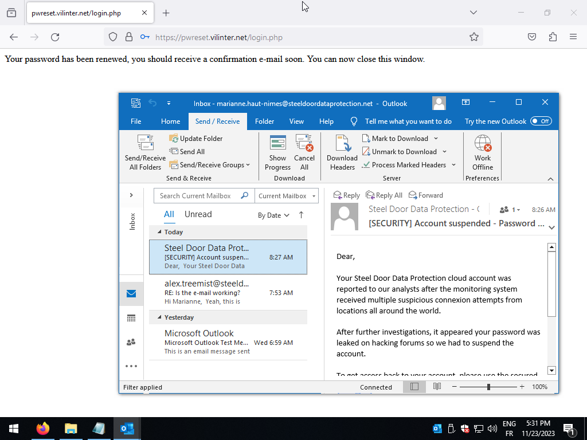
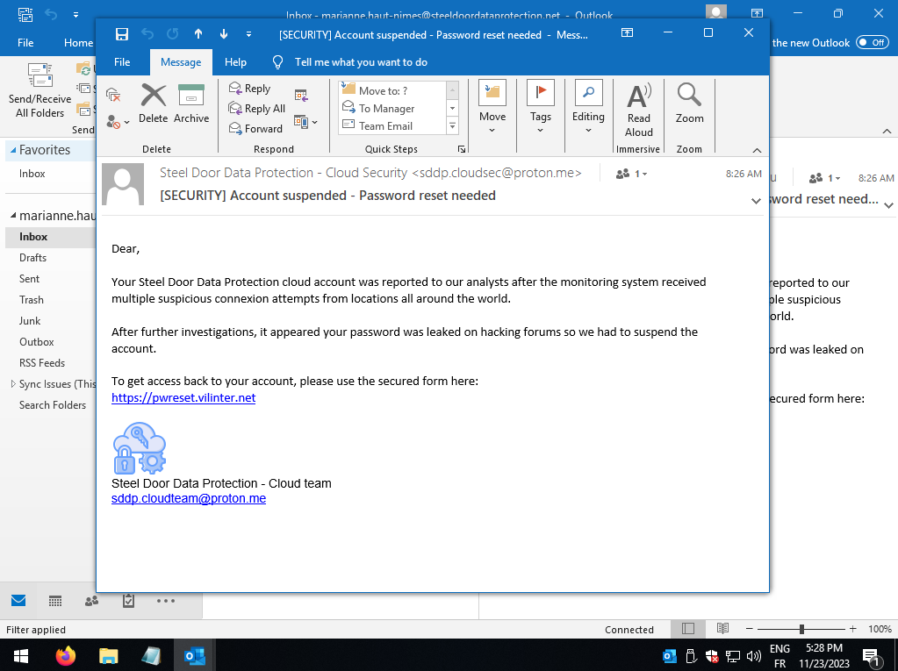

SUPPORT CENTER
Assistance SDDP

Ticket #488021
Priorité : Élevée

Name : Marianne Haut-Nîmes
Email :  marianne.haut-nimes@steeldoordataprotection.net
Départment : web

Sujet : un problème/Problème d'accès

Statut :  Ouvert 

Message : 

Bonjour,

J'ai peut-être fait une grosse erreur avec mon compte cloud SDDP. Je suis désolée pour cela !

Voici ce qui s'est passé : j'ai reçu un email indiquant que mon mot de passe devait être renouvelé, et
je l'ai rempli. Maintenant, je ne peux plus accéder à aucun de mes comptes ; lorsque je vais à l'écran
de connexion, mon nom d'utilisateur et mon mot de passe ne fonctionnent pas.

J'ai cru que la page était authentique car elle ressemblait vraiment à celle du service cloud interne
réel. Je suis désolée, j'aurais dû être plus prudente.

J'ai peur d'avoir vraiment gâché cette fois-ci. Pouvez-vous vérifier s'il y a un moyen de résoudre ce
problème et d'obtenir un vrai nouveau mot de passe ?

Désolée de vous faire perdre votre temps avec mes erreurs.
Merci,
Marianne
Développeuse junior

Pièces jointes :

